# Workforce Analytics Intelligence Platform - Enterprise System Architecture

This document presents the official enterprise architecture, security flow, database design, and folder structure for the **Workforce Analytics Intelligence Platform**.

---

## 1. System Architecture Diagram

```mermaid
graph TD
    %% User Tier
    subgraph USERS["Enterprise Users (5 RBAC Roles)"]
        ADMIN["Level 1: System Administrator"]
        HR["Level 2: HR Operations Manager"]
        MGR["Level 3: Department Manager (Eng, Fin, Sales, Mkt, Ops, Supp)"]
        TL["Level 4: Operational Team Lead"]
        EMP["Level 5: Employee Self-Service"]
    end

    %% Security & Authentication Gateway
    subgraph SECURITY_GATEWAY["Authentication & Security Gateway"]
        EMAIL_VERIF["1. Corporate Domain Verification (@company.com)"]
        PWD_CHECK["2. Password Validation"]
        MFA_VERIF["3. Multi-Factor Authentication (MFA OTP)"]
        JWT_ISSUER["4. JWT Access Token & Refresh Token Issuer"]
    end

    %% Authorization & Data Scope Engine
    subgraph AUTHORIZATION_ENGINE["Authorization Engine (RBAC + DBAC + ABAC)"]
        RBAC_GUARD["Role Validation Guard (RoleGuard)"]
        DBAC_GUARD["Department Access Guard (validateDepartmentAccess)"]
        PERM_GUARD["Permission Guard (PermissionGuard - 30+ Rules)"]
    end

    %% Presentation Layer
    subgraph FRONTEND["Frontend Application (React 18 + TypeScript + Vite)"]
        LAYOUTS["Enterprise Layouts (Header, Sidebar, DashboardLayout)"]
        MODULES["Modules (Dashboard, Employees, Attendance, Performance, Payroll, Reports, Users, Settings)"]
    end

    %% Business & Service Layer
    subgraph SERVICES["Business State & Service Layer"]
        REDUX["Redux Toolkit Store (authSlice, userSlice, permissionSlice)"]
        REACT_QUERY["React Query (Cache & Sync)"]
        AXIOS["Axios Client with JWT Interceptor"]
    end

    %% REST API & Database
    subgraph BACKEND["Backend REST API & Persistence"]
        GATEWAY["API Gateway Router"]
        DB_ENGINE[(PostgreSQL / MySQL Database)]
    end

    USERS --> SECURITY_GATEWAY
    SECURITY_GATEWAY --> AUTHORIZATION_ENGINE
    AUTHORIZATION_ENGINE --> FRONTEND
    FRONTEND --> SERVICES
    SERVICES --> BACKEND
    BACKEND --> DB_ENGINE
```



---

## 2. Layered Architecture Specifications

1. **Presentation Layer (`src/modules/`, `src/layouts/`)**: React 18, Vite, Material UI, Tailwind CSS, Recharts for dynamic charts and glassmorphism UI.
2. **Authorization & Security Layer (`src/authorization/`, `src/security/`)**:
   - **RBAC**: 5-level role hierarchy (`ADMIN`, `HR`, `MANAGER`, `TEAM_LEAD`, `EMPLOYEE`).
   - **DBAC**: Department-Based Access Control restricting managers to their department boundaries (e.g. Engineering Manager -> Engineering team; Finance Manager -> Payroll & Finance).
   - **Permission Matrix**: 30+ granular permissions covering User, Role, Employee, Attendance, Performance, Payroll, Reports, and System operations.
3. **Authentication Layer (`src/authentication/`, `src/auth/`)**:
   - Corporate Email Domain Enforcement (`@company.com`).
   - MFA OTP Verification Challenge.
   - JWT Bearer Token Injection & Auth Interceptor.
4. **State & Service Layer (`src/redux/`, `src/services/`)**:
   - Redux Toolkit Slices (`authSlice`, `userSlice`, `permissionSlice`).
   - `ApiService`, `StorageService`, and domain endpoint adapters.

---

## 3. Department Hierarchy & DBAC Mapping

```
Company Organization
│
├── Human Resources (HR Operations & Recruitment)
├── Engineering (Frontend, Backend, QA, DevOps)
├── Finance (Payroll, Salary Analytics, Budgets)
├── Sales (Regional & Enterprise Sales)
├── Marketing (Campaign Analytics & Lead Velocity)
├── Operations (Facility Logs & Logistics)
├── Customer Support (L1/L2 Ticket SLAs)
└── Administration (Executive Governance)
```

---

## 4. Complete Project Directory Layout

```
src/
├── app/                        # Application Bootstrap & Store Providers
├── authentication/             # Login, MFA, JWT Handler
│   ├── Login/
│   ├── MFA/
│   └── JWT/
├── authorization/              # ProtectedRoute, RoleGuard, PermissionGuard
│   ├── ProtectedRoute/
│   ├── RoleGuard/
│   └── PermissionGuard/
├── layouts/                    # Sidebar, Header, DashboardLayout
│   ├── Sidebar/
│   ├── Header/
│   └── DashboardLayout/
├── modules/                    # Domain Enterprise Modules
│   ├── Dashboard/
│   ├── Employees/
│   ├── Attendance/
│   ├── Performance/
│   ├── Payroll/
│   ├── Reports/
│   ├── Users/
│   └── Settings/
├── redux/                      # Redux Toolkit Slices
│   ├── authSlice.ts
│   ├── userSlice.ts
│   └── permissionSlice.ts
├── services/                   # Service Layer API Clients
│   ├── authService.ts
│   ├── employeeService.ts
│   ├── reportService.ts
│   └── api.service.ts
├── security/                   # Core Security Engines (RBAC, DBAC, ABAC)
└── features/                   # Core Page Implementations
```
