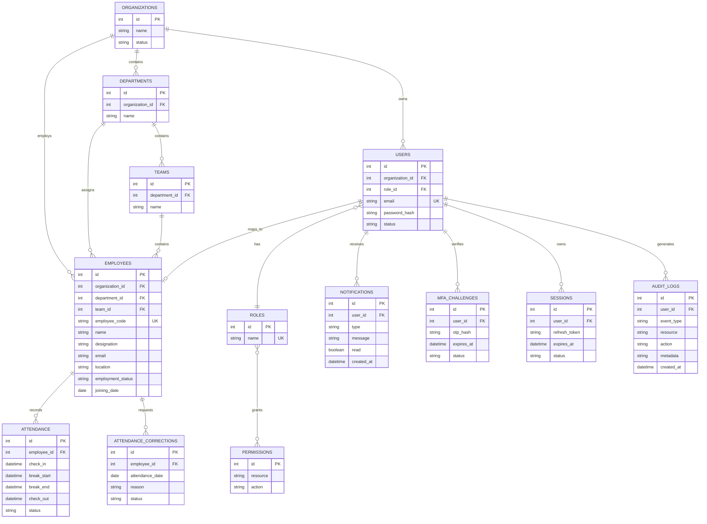

# 🗄️ Database Architecture

This document describes the SQLite relational structure, table relationships, constraints, and data domains in the Workforce Analytics system.

## 1. Entity Relationship (ER) Diagram

