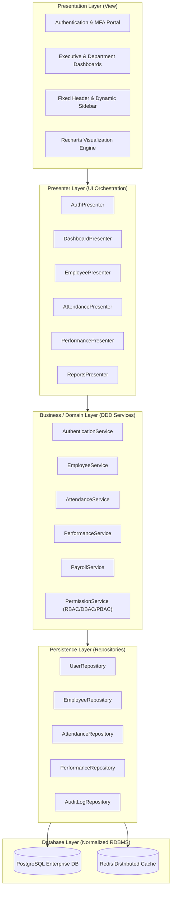
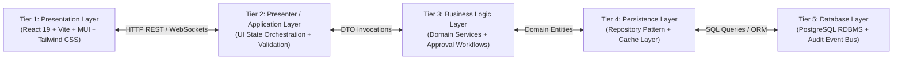
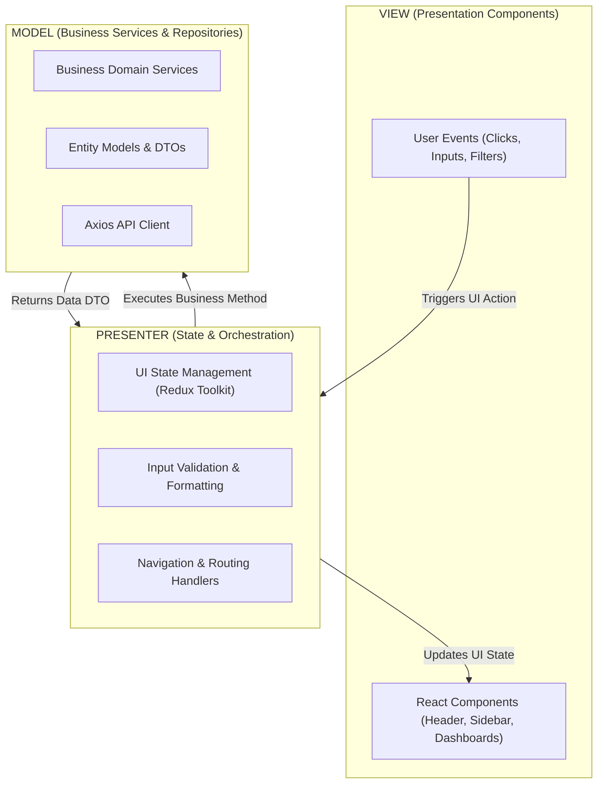
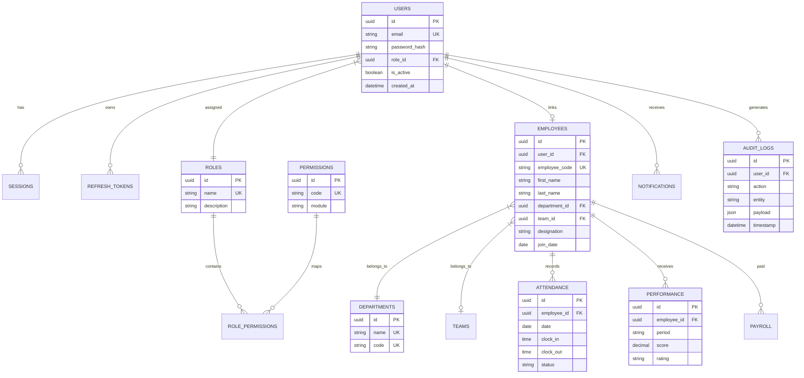
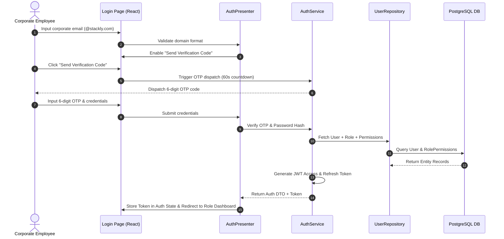
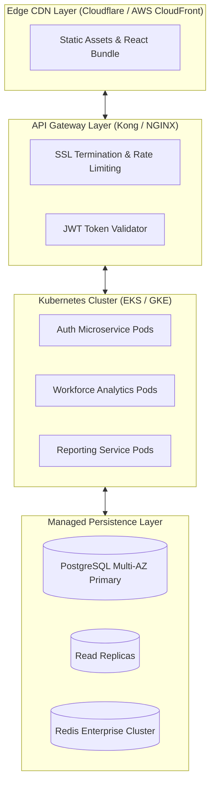

# WORKFORCE ANALYTICS DASHBOARD
## Comprehensive Enterprise Architecture & Technical Specifications

**Author:** Principal Solution Architect & Enterprise UI/UX Lead  
**Platform:** Stackly Workforce Analytics Intelligence Platform  
**Architecture Standard:** N-Tier, Domain-Driven Design (DDD), MVP (Model-View-Presenter), Repository Pattern, SOLID Principles  

---

## 1. Enterprise System Architecture

The **Stackly Workforce Analytics Platform** is an enterprise-grade workforce intelligence ecosystem designed for multi-tenant, role-based corporate operations. It enforces high availability, zero-trust security boundaries, and 5-layer separation of concerns.



---

## 2. N-Tier Architecture Diagram



---

## 3. MVP Architecture Diagram (Model-View-Presenter)



---

## 4. Domain-Driven Design Architecture (DDD)

The system is partitioned into explicit **Bounded Contexts**:
1. **Identity & Security Context**: User authentication, OTP verification, JWT token issuance, session clearance, RBAC/PBAC policy evaluation.
2. **Workforce Management Context**: Employee profile lifecycle, department structures, locations, reporting hierarchies, organization charts.
3. **Time & Attendance Context**: Daily clock-in/out records, shift schedules, remote WFH tracking, leave approvals.
4. **Performance & Talent Context**: Goal setting (KPIs/OKRs), quarterly performance reviews, rating calculations, talent risk assessment.
5. **Analytics & Governance Context**: Executive KPI rollups, custom report generation, export center, audit log streaming.

---

## 5. Frontend Architecture

Built on **React 19**, **TypeScript**, **Vite**, **Redux Toolkit**, and **Tailwind CSS**:

```text
src/
├── app/                  # Application initialization, Store, Providers & Routes
│   ├── providers/        # Redux, React Query, Theme Providers
│   ├── routes/           # Protected & Role-Guarded AppRoutes
│   └── store/            # Redux Toolkit store definition
├── auth/                 # Authentication domain (Hooks, Slices, Components)
│   ├── components/       # LoginForm, LogoutModal
│   ├── hooks/            # useAuth hook
│   ├── pages/            # LoginPage, LogoutPage
│   └── store/            # authSlice
├── business/             # Business Layer Domain Services (DDD)
│   ├── services/         # AuthService, EmployeeService, AttendanceService, etc.
│   └── validators/       # Domain business validators
├── components/           # Reusable Presentation UI Components
│   ├── cards/            # KPICard
│   ├── common/           # StacklyLogo, Badges
│   ├── header/           # Header, GlobalSearch, UserProfileMenu
│   ├── sidebar/          # Sidebar, RoleBasedMenu, UserProfile
│   └── tables/           # EmployeeTable, DataTable
├── design-system/        # Core theme tokens, color palettes, CSS variables
├── features/             # Feature Modules by Role & Domain
│   ├── admin/            # Admin Console, User & Role Management
│   ├── analytics/        # Recharts SVG charts (Growth, Distribution, Bar, Area)
│   ├── employee/         # Employee Portal, Profile, MyAttendance
│   ├── hr/               # HR Portal, Talent Pipeline, Attendance Management
│   └── manager/          # Manager Console, Approvals, Team Performance
├── persistence/          # Persistence Layer (Repository Implementation)
│   └── repositories/     # UserRepository, EmployeeRepository, AttendanceRepository
├── security/             # Security Layer (RBAC, DBAC, PBAC)
│   ├── audit/            # AuditLogger service
│   ├── guards/           # RoleGuard, PermissionGuard, ProtectedRoute
│   ├── permissions/      # Permission enum & definitions
│   └── roles/            # Role definitions & hierarchy
└── shared/               # Cross-cutting Utilities & Layout Shells
    ├── components/       # AdvancedFilterBar, DrillDownModal, SupportModal
    ├── layouts/          # MainLayout, EnterpriseHeader, Sidebar
    └── utils/            # Helper functions & formatters
```

---

## 6. Database ER Diagram



---

## 7. Authentication & Security Flow



---

## 8. Authorization Model: RBAC, DBAC & PBAC Matrix

### Role-Based Access Control (RBAC)
- **ADMIN**: Complete system governance, security policies, user management, audit logs.
- **HR MANAGER**: Organization workforce lifecycle, attendance, recruitment, performance, payroll reports.
- **DEPARTMENT MANAGER**: Department-scoped workforce metrics, leave approvals, department performance.
- **TEAM LEAD**: Sprint lead, team attendance, task allocation, team performance.
- **EMPLOYEE**: Self-service portal, my attendance, my leave, my performance reviews, my documents.

### Department-Based Access Control (DBAC)
Department Managers & HR Partners are strictly isolated to resources matching their assigned `department_id` scope (e.g., Engineering Manager cannot view Sales compensation records).

### Permission Matrix (PBAC)

| Permission Code | Admin | HR Manager | Dept Manager | Team Lead | Employee |
| :--- | :---: | :---: | :---: | :---: | :---: |
| `USER_MANAGE` | ✅ | ❌ | ❌ | ❌ | ❌ |
| `ROLE_MANAGE` | ✅ | ❌ | ❌ | ❌ | ❌ |
| `SYSTEM_CONFIG` | ✅ | ❌ | ❌ | ❌ | ❌ |
| `AUDIT_LOG_VIEW` | ✅ | ❌ | ❌ | ❌ | ❌ |
| `EMPLOYEE_VIEW_ALL` | ✅ | ✅ | ❌ | ❌ | ❌ |
| `EMPLOYEE_VIEW_DEPT` | ✅ | ✅ | ✅ | ❌ | ❌ |
| `ATTENDANCE_VIEW_ALL` | ✅ | ✅ | ❌ | ❌ | ❌ |
| `ATTENDANCE_APPROVE` | ✅ | ✅ | ✅ | ✅ | ❌ |
| `PERFORMANCE_MANAGE` | ✅ | ✅ | ✅ | ❌ | ❌ |
| `REPORT_EXPORT` | ✅ | ✅ | ✅ | ❌ | ❌ |
| `PROFILE_VIEW_SELF` | ✅ | ✅ | ✅ | ✅ | ✅ |

---

## 9. Sidebar Architecture Specifications
- **Fixed Width**: `280px` expanded, `80px` collapsed mode.
- **Header Section**: Mint-teal & deep-navy ribbon SVG logo, **Stackly Workforce Analytics** branding, subtitle **Workforce Intelligence Platform**, collapse/expand toggle button.
- **Menu Hierarchy**:
  1. *Dashboard* (Overview, Workforce Insights)
  2. *Workforce Management* (Employees, Departments, Locations, Org Chart)
  3. *Attendance Management* (Attendance Dashboard, Check In/Out, My Attendance, Team Attendance, Reports, Shifts)
  4. *Performance Management* (Performance Dashboard, Reviews, Goals/KPIs, Reports)
  5. *Reports & Analytics* (Workforce Reports, Attendance Reports, Performance Reports, Export Center)
  6. *Administration* (User Management, Roles & Permissions, System Settings, Audit Logs)
- **User Profile Footer Card**: Employee photo, Name (`Maheswari Pinneti`), Title (`Frontend Developer`), Department (`Engineering`), with actions for *Profile*, *Account Settings*, and *Logout Modal*.

---

## 10. Header Architecture Specifications
- **Fixed Top Bar (`h-[72px] sticky top-0 z-40`)**: Glassmorphism backdrop blur, zero reload, persistent layout.
- **Left Section**: Sidebar hamburger toggle, dynamic drill-down breadcrumb navigation (`Workforce / Employees / Employee Profile`), dynamic page context actions (`+ Add Employee`, `Import`, `Export`, `Check In / Out`, `Save Changes`).
- **Center Section**: Fixed global search box (`Search employees, reports, departments...`) with category filters (`All`, `Employees`, `Departments`, `Reports`, `Security`).
- **Right Section**: Notifications bell (3 unread badge), team messages, theme toggle (`Light` ↔ `Dark Navy`), Help Desk support icon, user avatar profile menu.

---

## 11. Deployment & Infrastructure Architecture


