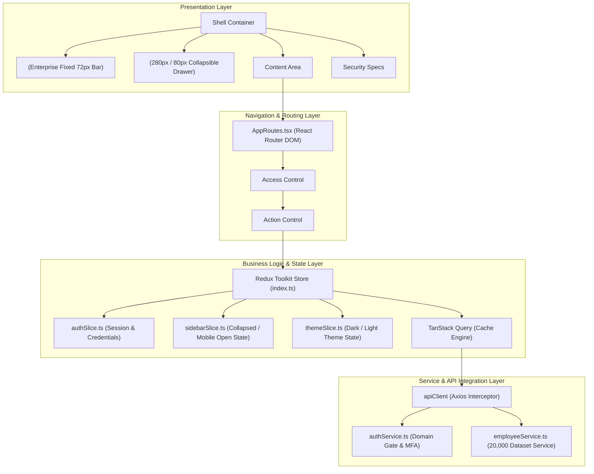
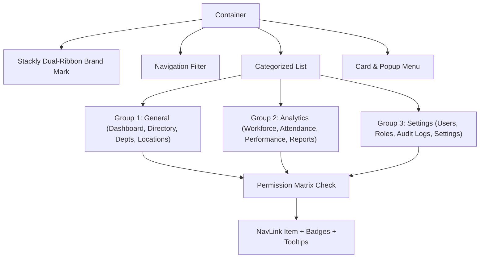
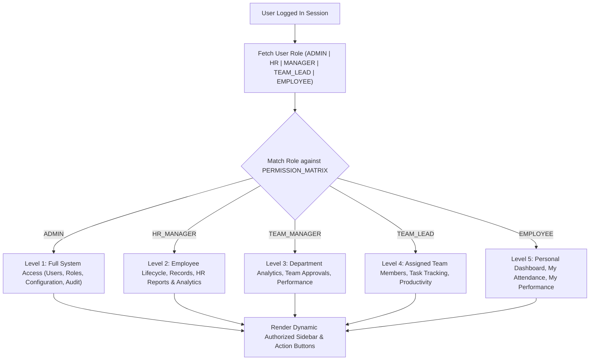
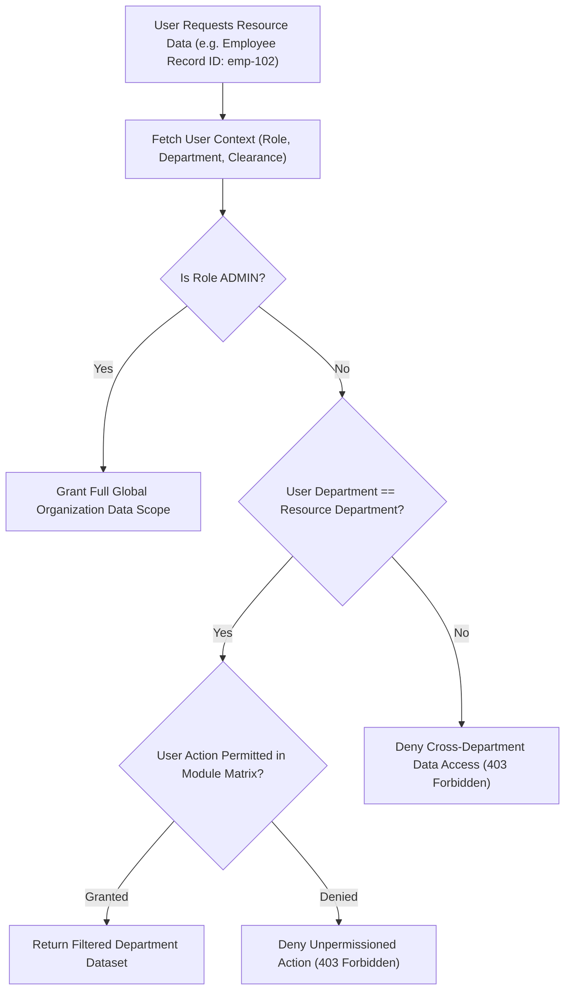
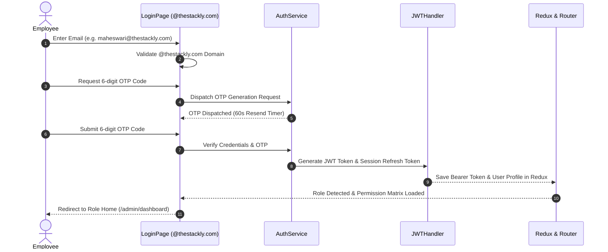

# STACKLY Workforce Analytics Dashboard
## Production Frontend Architecture & Security Flow Specifications

**Project Name:** STACKLY Workforce Analytics Dashboard  
**Architecture:** Enterprise Feature-Based Layered MVP Architecture  
**Technology Stack:** React 19, TypeScript, Vite, Tailwind CSS, Material UI, Redux Toolkit, React Query, Recharts, Framer Motion  

---

## 1. Complete Frontend Architecture Diagram

---

## 2. Sidebar Component Architecture Diagram

---

## 3. RBAC Flow Diagram

---

## 4. DBAC (Department Based Access Control) Permission Flow Diagram

---

## 5. User Authentication Flow Diagram

