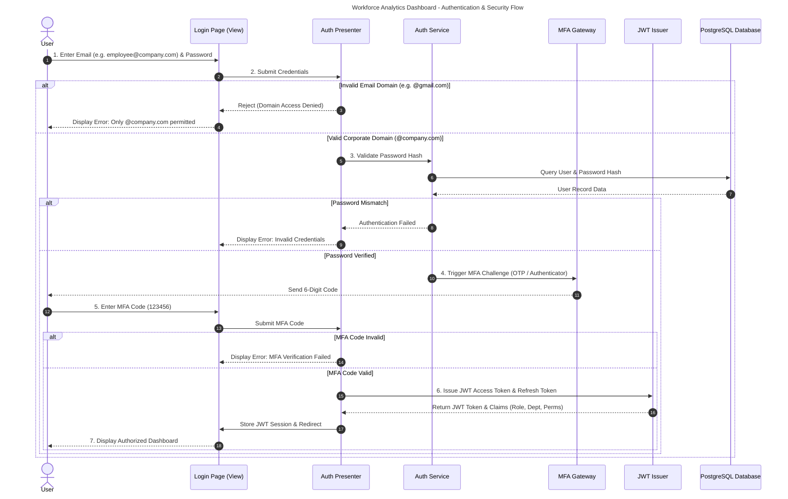
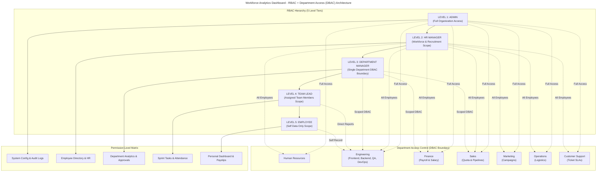
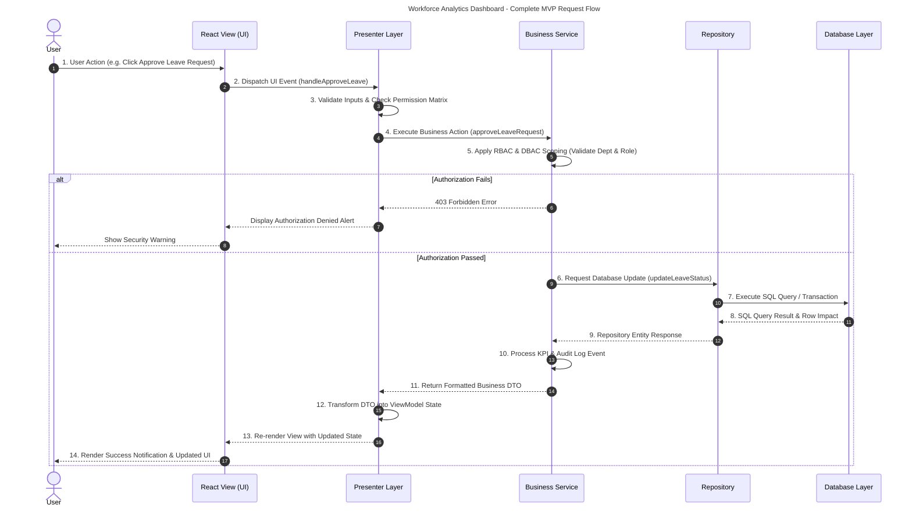
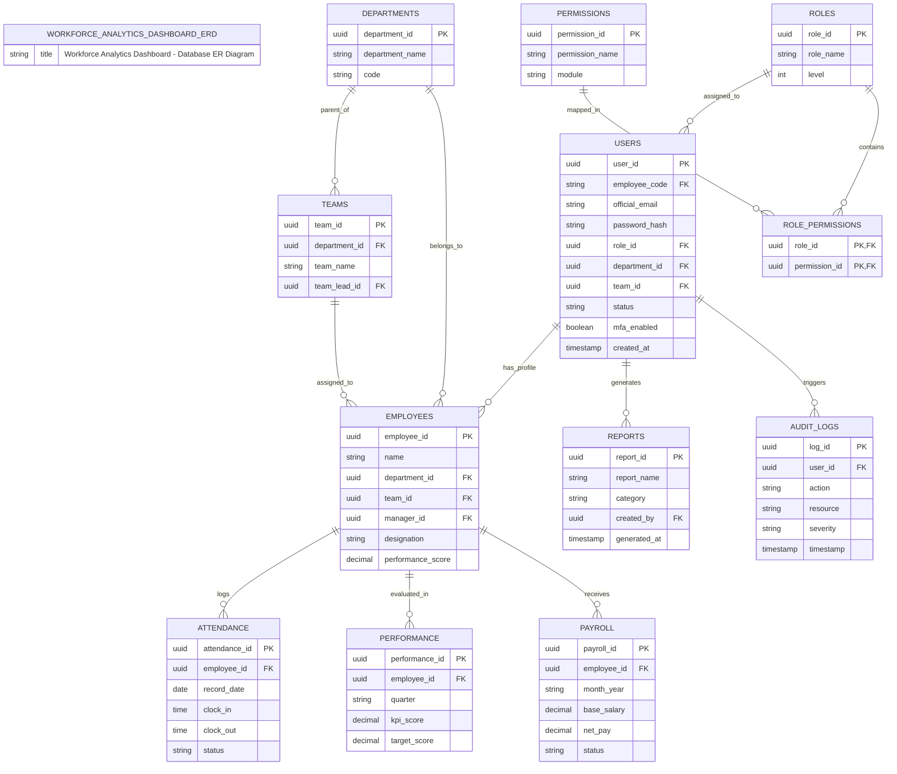
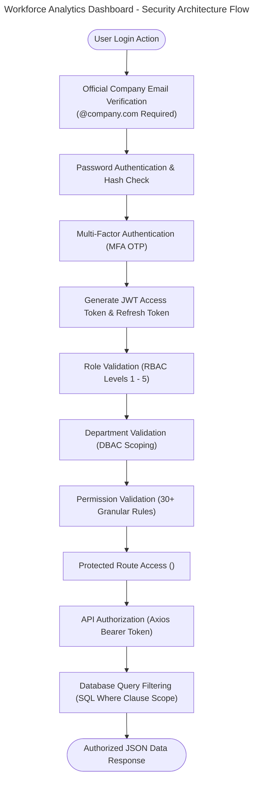

# Workforce Analytics Dashboard - MVP Enterprise Architecture

This document defines the 5-layer Model-View-Presenter (MVP) enterprise architecture, authentication flow, RBAC + DBAC security architecture, request sequence flow, database ER model, and frontend directory structure for the **Workforce Analytics Dashboard**.

---

## 1. MVP Enterprise Architecture Diagram

```mermaid
---
title: "Workforce Analytics Dashboard - MVP Enterprise Architecture"
---
flowchart TD
    subgraph USERS["Enterprise Users"]
        U1["Admin (System Admin)"]
        U2["HR Manager (HR Ops)"]
        U3["Dept Manager (Engineering / Finance / Sales)"]
        U4["Team Lead (Sprint Lead)"]
        U5["Employee (Self-Service)"]
    end

    subgraph VIEW["PRESENTATION LAYER (VIEW - React 18 + TS + Vite)"]
        V_LOGIN["Login Page"]
        V_DASH["Dashboard & KPI Cards"]
        V_EMP["Employee Dashboard"]
        V_ATT["Attendance Dashboard"]
        V_PERF["Performance Dashboard"]
        V_REP["Reports Dashboard"]
        V_USER_MGMT["User Management"]
        V_ROLE_MGMT["Role Management"]
        V_PERM_MGMT["Permission Management"]
        V_SETT["System Settings"]
        V_COMP["Recharts, Tables & Filter Bars"]
    end

    subgraph PRESENTER["PRESENTER LAYER (State & Event Validation)"]
        P_AUTH["Authentication Presenter"]
        P_DASH["Dashboard Presenter"]
        P_EMP["Employee Presenter"]
        P_ATT["Attendance Presenter"]
        P_PERF["Performance Presenter"]
        P_REP["Report Presenter"]
        P_PERM["Permission Presenter"]
    end

    subgraph BUSINESS["BUSINESS LAYER (Business Services & Rules)"]
        B_AUTH["Authentication Service"]
        B_USER["User Management Service"]
        B_ROLE["Role Service"]
        B_PERM["Permission Service"]
        B_EMP["Employee Service"]
        B_DEPT["Department Service"]
        B_ATT["Attendance Service"]
        B_PERF["Performance Service"]
        B_PAY["Payroll Service"]
        B_REP["Report Service"]
        B_NOTIF["Notification Service"]
    end

    subgraph PERSISTENCE["PERSISTENCE LAYER (Repositories & Data Access)"]
        R_USER["User Repository"]
        R_EMP["Employee Repository"]
        R_ROLE["Role Repository"]
        R_PERM["Permission Repository"]
        R_DEPT["Department Repository"]
        R_TEAM["Team Repository"]
        R_ATT["Attendance Repository"]
        R_PERF["Performance Repository"]
        R_PAY["Payroll Repository"]
        R_REP["Report Repository"]
    end

    subgraph DB["DATABASE LAYER (Relational Schema)"]
        DB_USERS[("USERS")]
        DB_ROLES[("ROLES")]
        DB_PERMS[("PERMISSIONS")]
        DB_ROLE_PERMS[("ROLE_PERMISSIONS")]
        DB_DEPTS[("DEPARTMENTS")]
        DB_TEAMS[("TEAMS")]
        DB_EMPS[("EMPLOYEES")]
        DB_ATT[("ATTENDANCE")]
        DB_PERF[("PERFORMANCE")]
        DB_PAY[("PAYROLL")]
        DB_REPS[("REPORTS")]
        DB_AUDIT[("AUDIT_LOGS")]
    end

    USERS --> VIEW
    VIEW --> PRESENTER
    PRESENTER --> BUSINESS
    BUSINESS --> PERSISTENCE
    PERSISTENCE --> DB
```

---

## 2. Authentication Flow

---

## 3. RBAC + Department Access (DBAC) Architecture

---

## 4. Complete Request Flow

---

## 5. Database ER Diagram

---

## 6. Frontend Folder Architecture

```mermaid
---
title: "Workforce Analytics Dashboard - Frontend Folder Architecture"
---
graph TD
    SRC["src"]

    SRC --> PRESENTATION["presentation"]
    PRESENTATION --> P_COMP["components (Recharts, Tables, FilterBars)"]
    PRESENTATION --> P_PAGES["pages (Dashboard, Employees, Attendance, Performance, Payroll, Reports, Settings)"]
    PRESENTATION --> P_LAYOUTS["layouts (Header, Sidebar, DashboardLayout)"]

    SRC --> PRESENTERS["presenters"]
    PRESENTERS --> PR_AUTH["authPresenter.ts"]
    PRESENTERS --> PR_EMP["employeePresenter.ts"]
    PRESENTERS --> PR_ATT["attendancePresenter.ts"]
    PRESENTERS --> PR_PERF["performancePresenter.ts"]
    PRESENTERS --> PR_REP["reportPresenter.ts"]

    SRC --> BUSINESS["business"]
    BUSINESS --> B_RULES["rbacRules.ts"]
    BUSINESS --> B_DBAC["dbacRules.ts"]
    BUSINESS --> B_KPI["kpiCalculator.ts"]

    SRC --> SERVICES["services"]
    SERVICES --> S_API["apiService.ts"]
    SERVICES --> S_AUTH["authService.ts"]
    SERVICES --> S_EMP["employeeService.ts"]

    SRC --> REPOS["repositories"]
    REPOS --> R_USER["userRepository.ts"]
    REPOS --> R_EMP["employeeRepository.ts"]

    SRC --> REDUX["redux"]
    REDUX --> RD_AUTH["authSlice.ts"]
    REDUX --> RD_USER["userSlice.ts"]
    REDUX --> RD_PERM["permissionSlice.ts"]

    SRC --> ROUTES["routes"]
    ROUTES --> RT_APP["AppRoutes.tsx"]

    SRC --> UTILS["utils"]
    UTILS --> U_HELPERS["helpers.ts"]
```

---

## 7. Security Architecture

