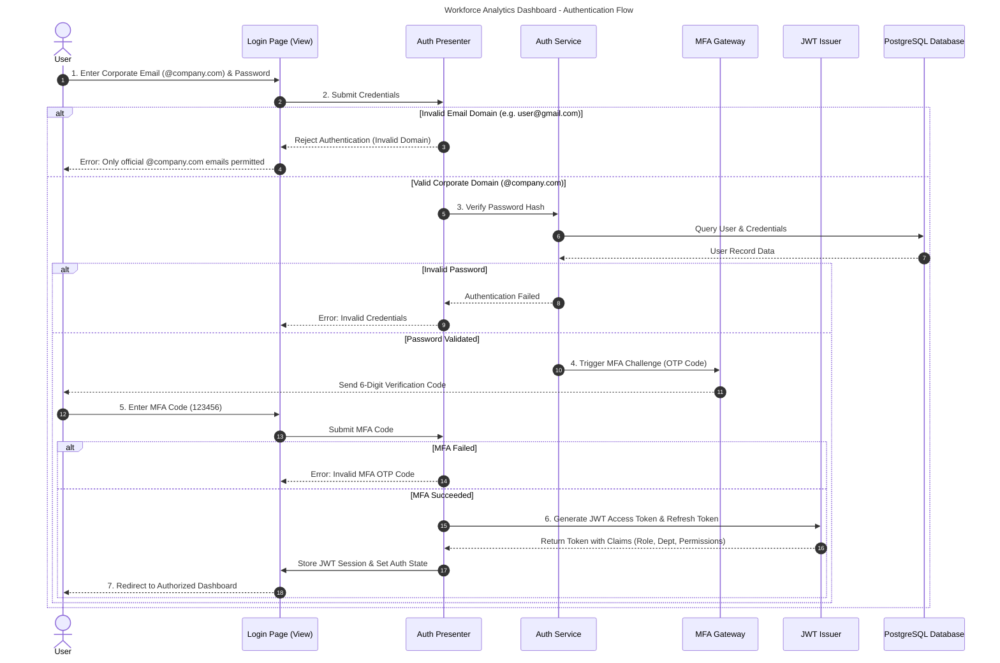
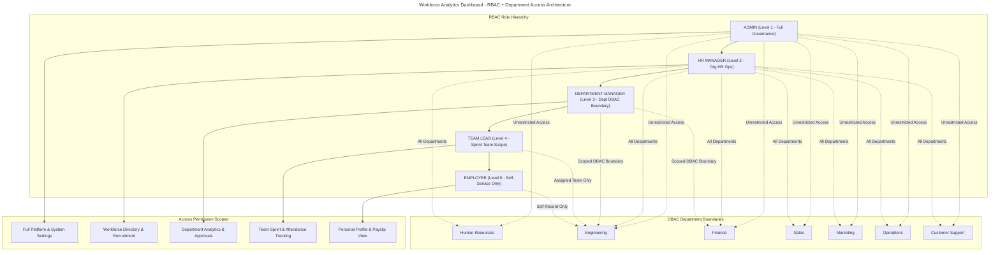
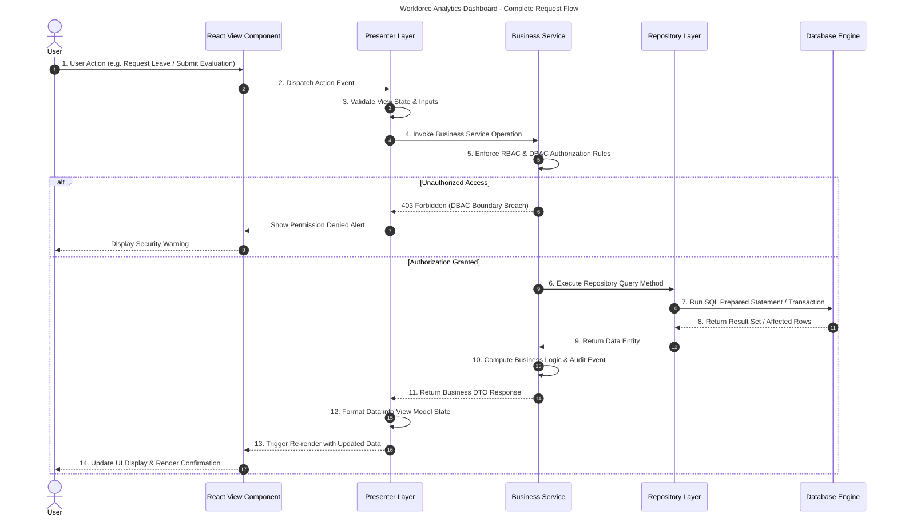
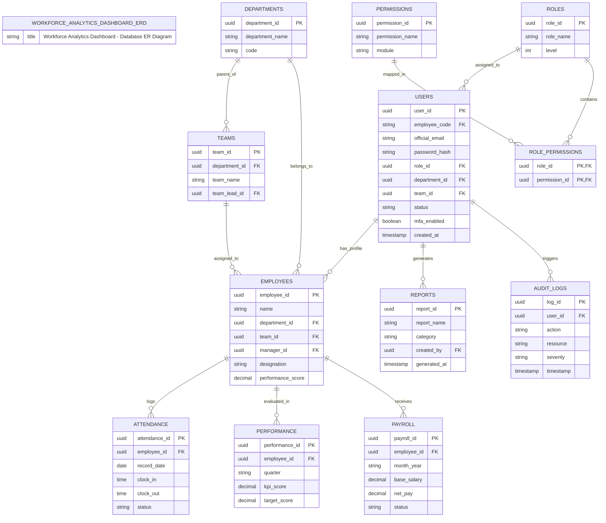

```mermaid
---
title: "Workforce Analytics Dashboard - Frontend Folder Architecture"
---
graph TD
    SRC["src"]

    SRC --> PRESENTATION["presentation"]
    PRESENTATION --> P_COMP["components (Recharts, Tables, FilterBars)"]
    PRESENTATION --> P_PAGES["pages (Dashboard, Employees, Attendance, Performance, Payroll, Reports, Settings)"]
    PRESENTATION --> P_LAYOUTS["layouts (Header, Sidebar, DashboardLayout)"]

    SRC --> PRESENTERS["presenters"]
    PRESENTERS --> PR_AUTH["authPresenter.ts"]
    PRESENTERS --> PR_EMP["employeePresenter.ts"]
    PRESENTERS --> PR_ATT["attendancePresenter.ts"]
    PRESENTERS --> PR_PERF["performancePresenter.ts"]
    PRESENTERS --> PR_REP["reportPresenter.ts"]

    SRC --> BUSINESS["business"]
    BUSINESS --> B_RULES["rbacRules.ts"]
    BUSINESS --> B_DBAC["dbacRules.ts"]
    BUSINESS --> B_KPI["kpiCalculator.ts"]

    SRC --> SERVICES["services"]
    SERVICES --> S_API["apiService.ts"]
    SERVICES --> S_AUTH["authService.ts"]
    SERVICES --> S_EMP["employeeService.ts"]

    SRC --> REPOS["repositories"]
    REPOS --> R_USER["userRepository.ts"]
    REPOS --> R_EMP["employeeRepository.ts"]

    SRC --> REDUX["redux"]
    REDUX --> RD_AUTH["authSlice.ts"]
    REDUX --> RD_USER["userSlice.ts"]
    REDUX --> RD_PERM["permissionSlice.ts"]

    SRC --> ROUTES["routes"]
    ROUTES --> RT_APP["AppRoutes.tsx"]

    SRC --> UTILS["utils"]
    UTILS --> U_HELPERS["helpers.ts"]
```

# WORKFORCE ANALYTICS DASHBOARD
## Enterprise System Architecture & Technical Specifications (MVP Design Pattern)

The **Workforce Analytics Dashboard** is an enterprise-grade workforce intelligence platform built on a 5-Layer **Model-View-Presenter (MVP)** architecture pattern. This document provides complete architectural specifications, layer responsibilities, sequence flows, security boundaries, and database entity relationships.

---

## 1. MVP Enterprise Architecture Diagram

```mermaid
---
title: "Workforce Analytics Dashboard - MVP Enterprise Architecture"
---
flowchart TD
    subgraph USERS["Enterprise Users (5 Role Tiers)"]
        U1["Admin (System Administrator)"]
        U2["HR Manager (HR Operations)"]
        U3["Dept Manager (Department Head)"]
        U4["Team Lead (Sprint Lead)"]
        U5["Employee (Self-Service)"]
    end

    subgraph VIEW["1. PRESENTATION LAYER (VIEW)"]
        V_LOGIN["Login Page"]
        V_DASH["Admin Dashboard"]
        V_EMP_DASH["Employee Dashboard"]
        V_ATT_DASH["Attendance Dashboard"]
        V_PERF_DASH["Performance Dashboard"]
        V_REP_DASH["Reports Dashboard"]
        V_USER_MGMT["User Management"]
        V_ROLE_MGMT["Role Management"]
        V_PERM_MGMT["Permission Management"]
        V_SETTINGS["System Settings"]
        V_COMPONENTS["UI Components (Recharts, Tables, Filters)"]
    end

    subgraph PRESENTER["2. PRESENTER LAYER (UI Logic & ViewModel)"]
        P_AUTH["Authentication Presenter"]
        P_DASH["Dashboard Presenter"]
        P_EMP["Employee Presenter"]
        P_ATT["Attendance Presenter"]
        P_PERF["Performance Presenter"]
        P_REP["Report Presenter"]
        P_PERM["Permission Presenter"]
    end

    subgraph BUSINESS["3. BUSINESS LAYER (Core Business Services)"]
        B_AUTH["Authentication Service"]
        B_USER["User Management Service"]
        B_ROLE["Role Service"]
        B_PERM["Permission Service"]
        B_EMP["Employee Service"]
        B_DEPT["Department Service"]
        B_ATT["Attendance Service"]
        B_PERF["Performance Service"]
        B_PAY["Payroll Service"]
        B_REP["Report Service"]
        B_NOTIF["Notification Service"]
    end

    subgraph PERSISTENCE["4. PERSISTENCE LAYER (Repositories)"]
        R_USER["User Repository"]
        R_EMP["Employee Repository"]
        R_ROLE["Role Repository"]
        R_PERM["Permission Repository"]
        R_DEPT["Department Repository"]
        R_TEAM["Team Repository"]
        R_ATT["Attendance Repository"]
        R_PERF["Performance Repository"]
        R_PAY["Payroll Repository"]
        R_REP["Report Repository"]
    end

    subgraph DB["5. DATABASE LAYER (Relational Storage)"]
        DB_USERS[("USERS")]
        DB_ROLES[("ROLES")]
        DB_PERMS[("PERMISSIONS")]
        DB_ROLE_PERMS[("ROLE_PERMISSIONS")]
        DB_DEPTS[("DEPARTMENTS")]
        DB_TEAMS[("TEAMS")]
        DB_EMPS[("EMPLOYEES")]
        DB_ATT[("ATTENDANCE")]
        DB_PERF[("PERFORMANCE")]
        DB_PAY[("PAYROLL")]
        DB_REPS[("REPORTS")]
        DB_AUDIT[("AUDIT_LOGS")]
    end

    USERS --> VIEW
    VIEW --> PRESENTER
    PRESENTER --> BUSINESS
    BUSINESS --> PERSISTENCE
    PERSISTENCE --> DB
```



---

## 2. Detailed Layer Specifications

### 1. Presentation Layer (View)
- **Components**: `Login Page`, `Dashboard`, `Employee Dashboard`, `Attendance Dashboard`, `Performance Dashboard`, `Reports Dashboard`, `User Management`, `Role Management`, `Permission Management`, `Settings`, `Charts`, `Tables`, `Filters`.
- **Responsibilities**:
  - Render dynamic user interfaces & glassmorphism components.
  - Receive user mouse/keyboard input events.
  - Render real-time SVG charts (Recharts) and data tables.
  - Display role-based views dynamically based on user session state.
- **Technologies**: React 18/19, TypeScript, Vite, React Router, Redux Toolkit, React Query, Material UI, Tailwind CSS, Recharts.

### 2. Presenter Layer
- **Components**: `Authentication Presenter`, `Dashboard Presenter`, `Employee Presenter`, `Attendance Presenter`, `Performance Presenter`, `Report Presenter`, `Permission Presenter`.
- **Responsibilities**:
  - Connect View components with Business Layer services.
  - Intercept UI events and validate user action prerequisites.
  - Transform raw DTO responses into UI ViewModels.
  - Validate form fields and user permissions before dispatching.

### 3. Business Layer
- **Services**: `Authentication Service`, `User Management Service`, `Role Service`, `Permission Service`, `Employee Service`, `Department Service`, `Attendance Service`, `Performance Service`, `Payroll Service`, `Report Service`, `Notification Service`.
- **Responsibilities**:
  - Execute business rules & KPI calculation logic.
  - Enforce RBAC validation & DBAC department access boundaries.
  - Handle approval workflows & event notifications.
- **Business Rule Example**:
  ```text
  IF user.role == "ENGINEERING_MANAGER" AND department == "ENGINEERING":
      ALLOW: Engineering analytics & team metrics
      DENY: Finance payroll & salary records
  ```

### 4. Persistence Layer
- **Repositories**: `User Repository`, `Employee Repository`, `Role Repository`, `Permission Repository`, `Department Repository`, `Team Repository`, `Attendance Repository`, `Performance Repository`, `Payroll Repository`, `Report Repository`.
- **Responsibilities**:
  - Abstract database communication and query construction.
  - Perform CRUD operations and data mapping.
  - Manage database transactions and connection pools.

### 5. Database Layer
- **Tables**: `USERS`, `ROLES`, `PERMISSIONS`, `ROLE_PERMISSIONS`, `DEPARTMENTS`, `TEAMS`, `EMPLOYEES`, `ATTENDANCE`, `PERFORMANCE`, `PAYROLL`, `REPORTS`, `AUDIT_LOGS`.
- **Relationships**:
  - User belongs to Role (`USERS.role_id -> ROLES.role_id`)
  - User belongs to Department (`USERS.department_id -> DEPARTMENTS.department_id`)
  - Department contains Teams (`DEPARTMENTS -> TEAMS`)
  - Team contains Employees (`TEAMS -> EMPLOYEES`)
  - Role contains Permissions (`ROLES -> ROLE_PERMISSIONS -> PERMISSIONS`)
  - Employee has Attendance (`EMPLOYEES -> ATTENDANCE`)
  - Employee has Performance (`EMPLOYEES -> PERFORMANCE`)

---

## 3. Authentication & Security Flow



---

## 4. RBAC + Department Access (DBAC) Architecture



---

## 5. Complete Request Flow



---

## 6. Database ER Diagram



---

## 7. Frontend Folder Architecture



---

## 8. Security Architecture Flow


