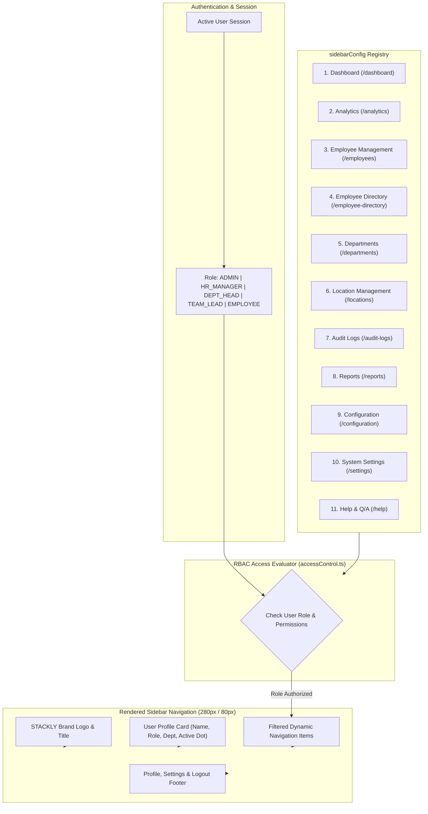

# STACKLY - Workforce Analytics Dashboard
## Enterprise Sidebar Navigation Architecture & Specifications

**Author:** Senior Frontend Architect & UI/UX Engineer  
**Stack:** React 19, TypeScript, Material UI, Tailwind CSS, Redux Toolkit, React Router DOM  
**Access Control:** Role-Based Access Control (RBAC) + Permission-Based Navigation  
**Design Theme:** Dark Enterprise (`#0B1120`), Glassmorphism (`backdrop-blur-md`), Modern SaaS Dashboard  

---

## 1. Sidebar Navigation Flow & RBAC Architecture Diagram



---

## 2. Component Structure Architecture

```text
src/
├── config/
│   └── sidebarConfig.ts         # Central 11 Navigation Menu Registry & Submenu Items
├── rbac/
│   ├── roles.ts                 # Role Enum (ADMIN, HR_MANAGER, DEPARTMENT_HEAD, TEAM_LEAD, EMPLOYEE)
│   ├── permissions.ts           # Permission Enum (USER_CREATE, EMPLOYEE_VIEW, ATTENDANCE_APPROVE, etc.)
│   └── accessControl.ts         # Access control evaluation service
└── layouts/
    ├── Sidebar.tsx              # Main Container Sidebar Layout (280px / 80px)
    ├── SidebarItem.tsx          # NavLink & Animated Submenu Accordion Component
    ├── SidebarGroup.tsx         # Category Group Wrapper
    └── UserProfile.tsx          # User Profile Card (Name, Role, Dept, Online Dot)
```

---

## 3. Navigation Items & RBAC Access Matrix

| # | Navigation Menu Item | Route Path | Submenu Items | Allowed Roles |
|---|---|---|---|---|
| **1** | **Dashboard** | `/dashboard` | Overview, KPIs, Attendance, Performance | `ADMIN`, `HR_MANAGER`, `DEPARTMENT_HEAD`, `TEAM_LEAD`, `EMPLOYEE` |
| **2** | **Analytics** | `/analytics` | Workforce, Attendance, Performance, Productivity, Salary, Diversity | `ADMIN`, `HR_MANAGER`, `DEPARTMENT_HEAD` |
| **3** | **Employee Management** | `/employees` | Directory, Profile, Add Employee, Update, Lifecycle, Status | `ADMIN`, `HR_MANAGER` |
| **4** | **Employee Directory** | `/employee-directory` | Search, Filters, Department Listing, Role Listing | `ADMIN`, `HR_MANAGER`, `TEAM_LEAD`, `EMPLOYEE` |
| **5** | **Departments** | `/departments` | Overview, Department Analytics, Members, Performance | `ADMIN`, `HR_MANAGER`, `DEPARTMENT_HEAD` |
| **6** | **Location Management** | `/locations` | Office Locations, Distribution, Branch Management | `ADMIN`, `HR_MANAGER` |
| **7** | **Audit Logs** | `/audit-logs` | Login History, Activity Tracking, Permission Changes | `ADMIN` (Only) |
| **8** | **Reports** | `/reports` | Workforce, Attendance, Performance, Custom, Export | `ADMIN`, `HR_MANAGER`, `DEPARTMENT_HEAD` |
| **9** | **Configuration** | `/configuration` | Roles, Permissions, RBAC/DBAC Rules, Notifications | `ADMIN` (Only) |
| **10** | **System Settings** | `/settings` | Application, Security, Theme, Integration, Account | `ADMIN` |
| **11** | **Help & Q/A** | `/help` | Knowledge Base, User Guide, FAQ, Support Ticket | All Users |

---

## 4. UI Design System Tokens
- **Background**: Dark Navy (`#0B1120`)
- **Expanded Width**: `280px`
- **Collapsed Width**: `80px`
- **Active Menu Highlight**: `bg-gradient-to-r from-blue-600 to-indigo-600 text-white shadow-lg shadow-blue-500/25`
- **Online Indicator**: Green pulsing dot (`bg-emerald-400 animate-pulse`) with `● Active` text status badge.
- **Glassmorphism**: `backdrop-blur-md` with `border-slate-800/80`.
