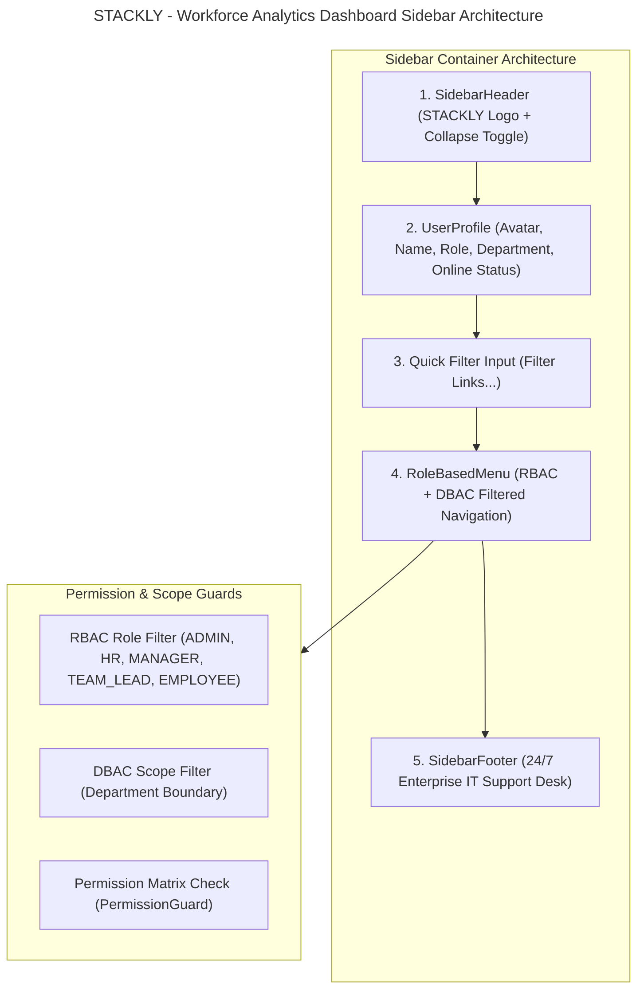

# STACKLY - Workforce Analytics Dashboard Sidebar Architecture

This document presents the enterprise responsive sidebar navigation architecture, role-based menu structures, component breakdown, permission filtering logic, and data models for **STACKLY - Workforce Analytics Dashboard**.

---

## 1. Sidebar Architecture Diagram



---

## 2. Role-Based Sidebar Hierarchy

### 1. ADMIN SIDEBAR
- **Dashboard**: Executive Overview, Workforce KPIs, Organization Analytics, Real-Time Insights
- **User Management**: All Users, Create User, User Directory, User Status, User Activity Logs
- **Role & Permission Management**: Roles, Permissions, Role Assignment, Access Control Matrix, Permission Audit
- **Organization Management**: Departments, Teams, Locations, Designations, Organization Structure
- **Employee Management**: Employee Directory, Employee Profiles, Employee Lifecycle, Onboarding, Offboarding
- **Workforce Analytics**: Workforce Overview, Headcount Analytics, Employee Distribution, Attrition Analytics, Workforce Trends
- **Attendance Management**: Attendance Overview, Attendance Reports, Leave Analytics, Shift Management
- **Performance Management**: Performance Dashboard, KPI Tracking, Performance Reviews, Goal Management
- **Payroll Analytics**: Salary Overview, Compensation Analytics, Payroll Reports
- **Reports**: Custom Reports, Scheduled Reports, Export Data
- **System Settings**: Application Settings, Security Settings, Audit Logs

### 2. HR MANAGER SIDEBAR
- **Dashboard**: HR Overview, Workforce Summary, HR KPIs
- **Employee Management**: Employee Directory, Add Employee, Employee Profile, Employee Lifecycle, Documents
- **Attendance**: Attendance Overview, Leave Management, Leave Approvals, Attendance Reports
- **Recruitment**: Candidates, Interview Tracking, Hiring Pipeline
- **HR Analytics**: Workforce Trends, Employee Insights, Attrition Analysis
- **Reports**: Employee Reports, Attendance Reports, Export Data

### 3. DEPARTMENT MANAGER SIDEBAR
- **Dashboard**: Department Overview, Department KPIs, Team Summary
- **My Department**: Department Employees, Organization Chart, Department Analytics, Resource Planning
- **Team Management**: Team Members, Assign Team Lead, Team Performance
- **Attendance**: Team Attendance, Leave Approvals
- **Performance**: Employee Performance, KPI Tracking, Reviews
- **Reports**: Department Reports, Export Data

### 4. TEAM LEAD SIDEBAR
- **Dashboard**: Team Overview, Team KPIs, Daily Summary
- **My Team**: Team Members, Member Profiles, Team Structure
- **Task & Productivity**: Task Status, Productivity Tracking, Work Progress
- **Attendance**: Team Attendance, Leave Requests, Attendance History
- **Performance**: Team Performance, Member Performance, Feedback
- **Reports**: Team Reports, Export Data

### 5. EMPLOYEE SIDEBAR
- **My Dashboard**: Personal Overview, My KPIs, Quick Actions
- **My Profile**: Personal Information, Employment Details, Documents
- **Attendance**: My Attendance, Attendance History, Apply Leave, Leave Status
- **My Performance**: Performance Score, Goals, Reviews, Feedback
- **My Requests**: Leave Requests, Service Requests, Request History
- **Notifications**: System Notifications & Alerts
- **Settings**: Account Settings, Change Password, Preferences

---

## 3. React Component Folder Structure (`src/components/sidebar/`)

```text
src/components/sidebar/
├── Sidebar.tsx             # Master Responsive Sidebar Container
├── SidebarHeader.tsx       # STACKLY Branding & Collapse Button
├── Logo.tsx                # Enterprise STACKLY Logo & Title
├── UserProfile.tsx         # User Avatar, Role, Department & Online Status
├── SidebarMenu.tsx         # Scrollable Navigation Container
├── MenuItem.tsx            # Navigation Link Item & Active State
├── MenuGroup.tsx           # Categorized Navigation Group Section
├── RoleMenu.tsx            # Security Scope Dropdown Switcher
├── RoleBasedMenu.tsx       # Dynamic Role Navigation Menu Component
├── PermissionGuard.tsx     # RBAC + DBAC + Permission Guard Component
├── SidebarFooter.tsx       # 24/7 IT Desk Support Link
├── types.ts                # TypeScript Interfaces (MenuItem, MenuGroupConfig)
├── menuConfig.ts           # Dynamic Role Menu Configuration Array
└── index.ts                # Central Module Export
```

---

## 4. TypeScript Interface Configuration

```typescript
export interface MenuItemConfig {
  id: string;
  title: string;
  icon: string;
  path?: string;
  roles?: Role[];
  permissions?: Permission[];
  departmentScope?: string[];
  badge?: {
    text: string;
    variant: 'blue' | 'purple' | 'amber' | 'emerald' | 'rose';
  };
  children?: MenuItemConfig[];
}
```

---

## 5. Permission Filtering Logic

```typescript
// Enforces Role + Permission + DBAC Boundary Filtering
export const PermissionGuard: React.FC<PermissionGuardProps> = ({
  roles,
  permissions,
  departmentScope,
  children,
  fallback = null,
}) => {
  const { role, permissions: userPermissions, user } = useAuth();

  if (roles && !roles.includes(role)) return <>{fallback}</>;
  if (permissions && !permissions.every((p) => userPermissions.includes(p))) return <>{fallback}</>;
  if (departmentScope && user?.department && !departmentScope.includes(user.department)) return <>{fallback}</>;

  return <>{children}</>;
};
```

---

## 6. Responsive Behavior & Design Style

- **Desktop (≥ 1024px)**: Fixed sticky sidebar (`w-[280px]` expanded, `w-[78px]` collapsed).
- **Tablet (768px - 1023px)**: Auto-collapsible compact sidebar with hover tooltips.
- **Mobile (< 768px)**: Drawer navigation with backdrop blur overlay (`fixed inset-0 bg-slate-950/70`).
- **Design Aesthetic**: Glassmorphism option (`backdrop-blur-md`), theme adaptive background (`var(--bg-secondary)`), active border indicators, Lucide React icons, and Microsoft Admin Center / AWS Console inspired styling.

---

## 7. Complete Header + Sidebar Layout Integration

```text
-----------------------------------------------------------------------------
| Logo | Breadcrumbs | Global Search (Ctrl + K) | Notifications | Theme | User |
-----------------------------------------------------------------------------
|          |                                                                |
| Sidebar  |                   Dashboard Content Area                       |
| Nav      |                                                                |
-----------------------------------------------------------------------------
```
