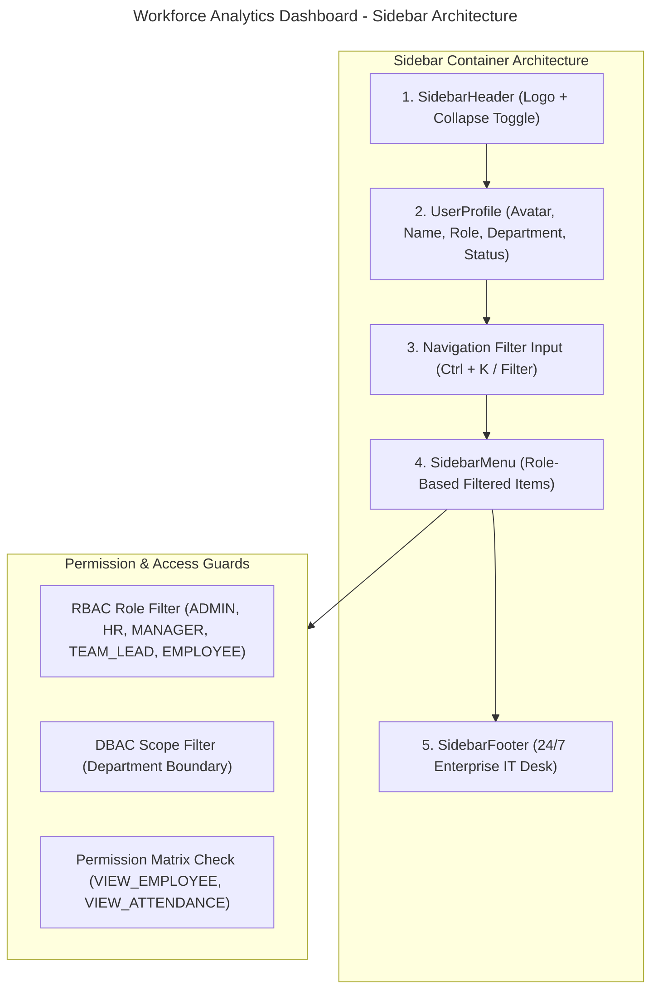

# Workforce Analytics Dashboard - Sidebar Navigation Architecture

This document presents the enterprise responsive sidebar navigation architecture, role-based menu structures, component breakdown, permission filtering logic, and data models for the **Workforce Analytics Dashboard**.

---

## 1. Sidebar Architecture Diagram



---

## 2. Role-Based Menu Hierarchy

### 1. ADMIN SIDEBAR
```text
Dashboard
├── Organization Overview
├── Workforce Analytics
└── KPI Dashboard

User Management
├── Users
├── Roles
└── Permissions

Organization
├── Departments
├── Teams
└── Locations

Employee Management
└── Employee Directory

System & Governance
├── Audit Logs (Live)
└── System Settings
```

### 2. HR MANAGER SIDEBAR
```text
Core Operations
└── HR Dashboard

Employees
├── Employee Directory
└── Recruitment & Candidates (Hiring)

Workforce Operations
├── Attendance Overview
├── Leave Management (5 New)
├── Performance Evaluation
└── Payroll Reports
```

### 3. DEPARTMENT MANAGER SIDEBAR
```text
Department Scope
├── Manager Dashboard
├── Department Overview
└── Department Analytics

Operations & Approvals
├── Team Attendance
├── Leave Approvals (3 Review)
└── Performance Reviews
```

### 4. TEAM LEAD SIDEBAR
```text
Team Scope
├── Team Dashboard
├── Task Status & Monitoring (8 Active)
├── Team Attendance
└── Team Performance
```

### 5. EMPLOYEE SIDEBAR
```text
Personal Portal
├── My Dashboard
├── My Profile
├── My Attendance
├── Leave Requests
├── My Performance
├── My Goals
└── Payslip View
```

---

## 3. React Component Architecture

```text
src/components/sidebar/
├── Sidebar.tsx             # Master Responsive Sidebar Container
├── SidebarHeader.tsx       # Logo Branding & Collapse Toggle
├── Logo.tsx                # Enterprise Brand Icon & Title
├── UserProfile.tsx         # Profile Avatar, Role & Department Badge
├── SidebarMenu.tsx         # Dynamic Menu Renderer
├── MenuItem.tsx            # Navigation Link & Active Indicator
├── MenuGroup.tsx           # Categorized Navigation Section
├── RoleMenu.tsx            # Security Scope Switcher
├── PermissionGuard.tsx     # RBAC + DBAC + Permission Filter
├── SidebarFooter.tsx       # 24/7 IT Desk Support
├── types.ts                # TypeScript Interfaces
├── menuConfig.ts           # Dynamic Role Menu Configurations
└── index.ts                # Central Module Export
```

---

## 4. TypeScript Data Structure

```typescript
export interface MenuItemConfig {
  id: string;
  title: string;
  icon: string;
  path?: string;
  roles?: Role[];
  permissions?: Permission[];
  departmentScope?: string[];
  badge?: {
    text: string;
    variant: 'blue' | 'purple' | 'amber' | 'emerald' | 'rose';
  };
  children?: MenuItemConfig[];
}

export interface MenuGroupConfig {
  groupTitle: string;
  items: MenuItemConfig[];
}
```

---

## 5. Permission-Based Menu Filtering Logic

```typescript
// Example: Engineering Department Manager
User: Engineering Manager
Role: Role.MANAGER
Department: "Engineering"
Permissions: [Permission.VIEW_ATTENDANCE, Permission.VIEW_PERFORMANCE]

RESULT:
Visible Menus:
  - Manager Dashboard
  - Department Overview
  - Department Analytics
  - Team Attendance
  - Leave Approvals
  - Performance Reviews

Hidden Menus:
  - Payroll Reports (Requires Permission.VIEW_PAYROLL)
  - System Settings (Requires Role.ADMIN)
  - User Management (Requires Permission.MANAGE_USERS)
```

---

## 6. Responsive Behavior & Design Style

- **Desktop (≥ 1024px)**: Fixed sticky sidebar (`w-[280px]` expanded, `w-[78px]` collapsed).
- **Tablet (768px - 1023px)**: Auto-collapsible sidebar with hover tooltips.
- **Mobile (< 768px)**: Slide-out drawer with backdrop blur overlay (`fixed inset-0 bg-slate-950/70`).
- **Design Aesthetic**: Glassmorphism backdrop blur, theme adaptive colors (`var(--bg-secondary)`), active border indicators, and Lucide React icons.
