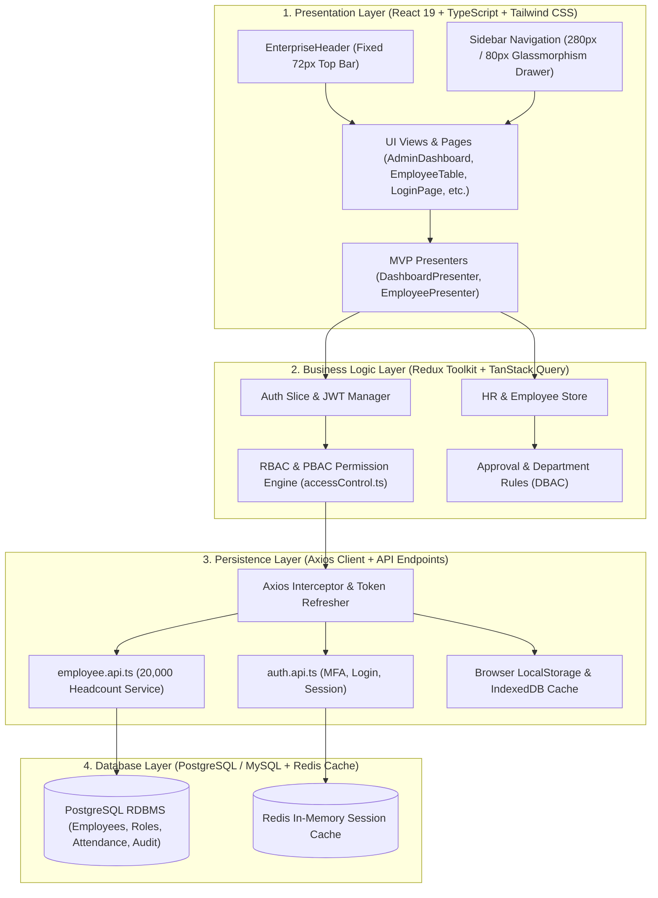
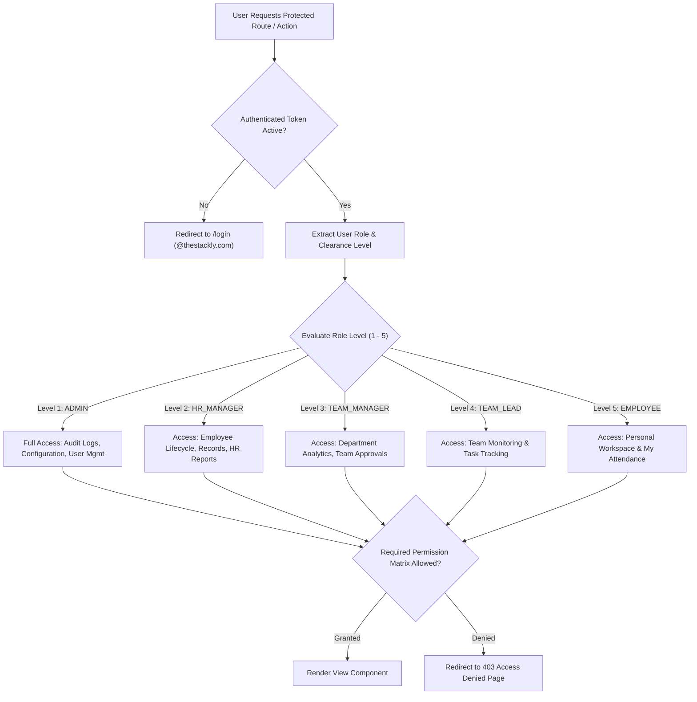
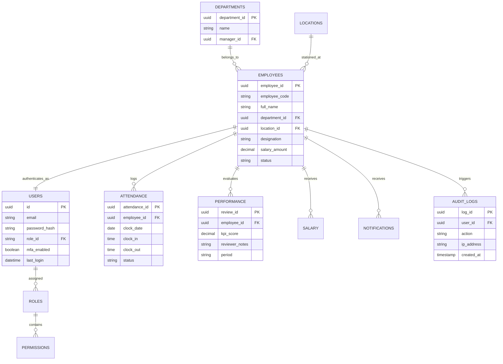
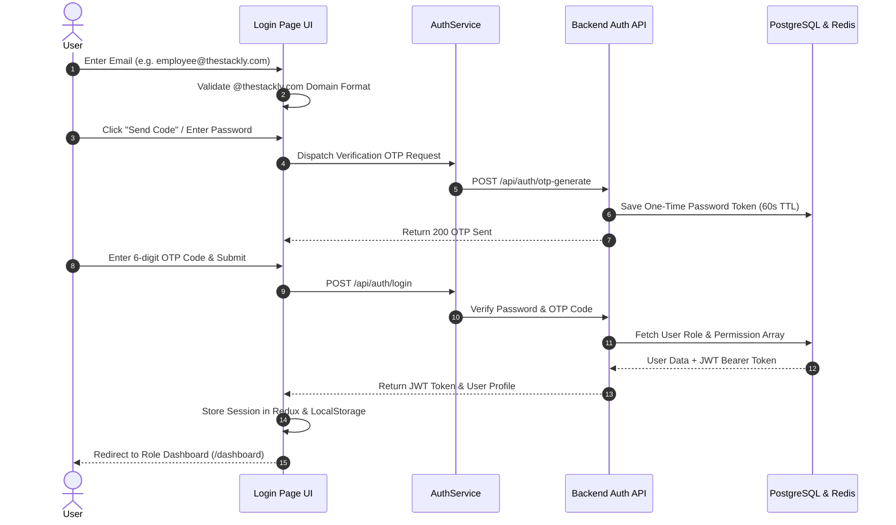
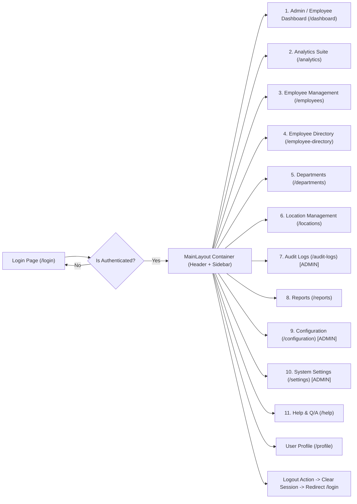

# Stackly Workforce Analytics Dashboard
## Production Enterprise Architecture & System Specifications

**System Name:** Stackly Workforce Analytics Dashboard  
**Architect:** Senior Solution Architect & Principal UI/UX Lead  
**Design Patterns:** MVP (Model-View-Presenter), 4-Layer Architecture (Presentation, Business Logic, Persistence, Database)  
**Security Framework:** RBAC (Role-Based Access Control) + DBAC (Department-Based Access Control)  

---

## 1. System Architecture Diagram (4-Layer & MVP Architecture)

---

## 2. RBAC Permission & Authorization Flow Diagram

---

## 3. Database ER Diagram (Relational Data Model)

---

## 4. User Authentication Flow Diagram (Multi-Factor & Domain Verification)

---

## 5. Application Navigation Flow Diagram

