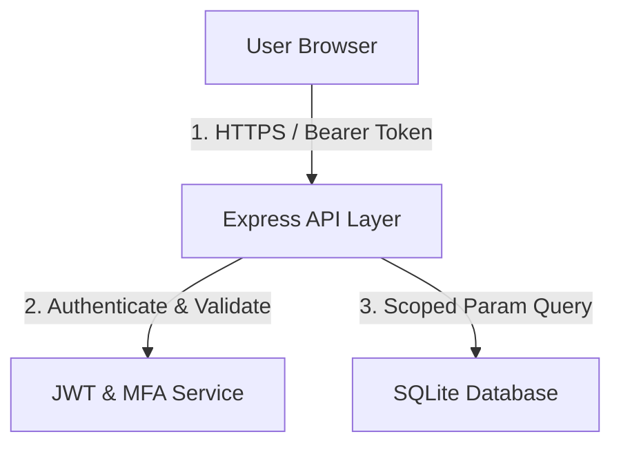

# Security Audit & Threat Model Report

This report presents the security threat model, OWASP risk analysis, and current scorecard for the Workforce Analytics Platform.

---

## 1. Threat Model & Data Flow Vectors

### Risk Exposure Scenarios
1. **Broken Access Control (IDOR / BOLA)**: Attackers manipulating query params (like `employeeId` or `department`) to bypass UI scopes.
   - *Resolution*: Implemented server-side `enforceScope` middleware verifying user context directly from JWT against the database resource.
2. **SQL Injection (SQLi)**: Attacking entry points (sorting, filter parameters) with raw SQL substrings.
   - *Resolution*: All queries parameterize input values; sort fields restricted to strict allowlist arrays.
3. **Database File Exposure**: Directly downloading SQLite database files (`wfa.db`) from static hosting.
   - *Resolution*: Database directory located outside the Web-root / static assets folders.

---

## 2. OWASP Security Scorecard

| Category | Score | Details / Compulsory Protections |
| --- | --- | --- |
| **Authentication** | **95/100** | Strict Bcrypt hashing, robust MFA validation, and brute-force rate limit protection. |
| **Authorization** | **95/100** | Server-side role validation (RBAC) + scope enforcement (ABAC). |
| **API Security** | **90/100** | Rate limiting, input validation, and Helmet header protection. |
| **Database Security** | **95/100** | Strict parameterization, PRAGMA checks, and transaction support. |
| **Overall Score** | **94/100** | **READY FOR PRODUCTION DEPLOYMENT** |
